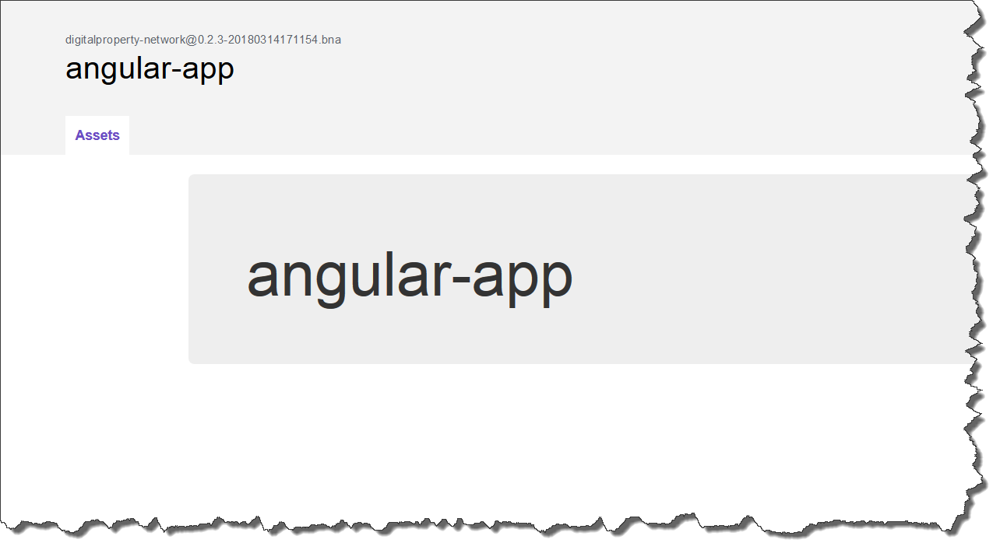

Section 1:  Lab Overview
========================

This lab will give you an opportunity to have hands on experience with Hyperledger Composer.
You will:

*	Install the Hyperledger Composer command line interface (CLI)
*	Use the CLI to deploy a Composer business network on a Hyperledger Fabric network
*	Install the Hyperledger Composer Playground and use it in “web browser” mode
*	Install and use the Hyperledger Composer REST Server
*	Generate an AngularJS GUI application based on a Hyperledger Composer business network
*	Use the Hyperledger Composer Playground directly connected to a Hyperledger Fabric network

Section 2: Install Hyperledger Composer Command Line Interface
==============================================================

In this section, you will install the Hyperledger Composer Command Line Interface (CLI) using *npm*.  This will also bring in other core 
modules of Hyperledger Composer (as you’ll see in the output from step 2). Then you will download a Hyperledger Composer sample business 
network from GitHub and prepare it for deployment on a Hyperledger Fabric network.  You will start a Hyperledger Fabric network via 
scripts provided by Hyperledger Composer for this purpose.  You will deploy the Hyperledger Composer business network onto the 
Hyperledger Fabric network and work with it.

**Step 1:** Install Hyperledger Composer using *npm*.  Enter this command::

 bcuser@ubuntu16042:~$ npm install -g composer-cli@0.11.3

This will take a few minutes to run, and will produce a lot of output.  If you do not see any error messages at the end of the output, 
chances are you are in good shape.  A couple of warning messages are okay.

**Step 2:** Check the location of the Hyperledger Composer binary, and check the Hyperledger Composer version::

 bcuser@ubuntu16042:~$ which composer
 /home/bcuser/bin/composer
 bcuser@ubuntu16042:~$ composer --version

 composer-cli                   v0.11.3
 composer-admin                 v0.11.3
 composer-client                v0.11.3
 composer-common                v0.11.3
 composer-runtime-hlf           v0.11.3
 composer-runtime-hlfv1         v0.11.3 

**Step 3:** Go to your home directory and get the Composer sample applications from GitHub::

 bcuser@ubuntu16042:~/zmarbles$ cd $HOME
 bcuser@ubuntu16042:~$ git clone https://github.com/hyperledger/composer-sample-applications
 Cloning into 'composer-sample-applications'...
 remote: Counting objects: 1012, done.
 remote: Total 1012 (delta 0), reused 0 (delta 0), pack-reused 1012
 Receiving objects: 100% (1012/1012), 34.46 MiB | 2.88 MiB/s, done.
 Resolving deltas: 100% (384/384), done. 
 Checking connectivity... done. 

**Step 4:** Change to the *composer-sample-applications/packages/digitalproperty-app* directory and do an *npm install*::

 bcuser@ubuntu16042:~$ cd composer-sample-applications/packages/digitalproperty-app
 bcuser@ubuntu16042:~/composer-sample-applications/packages/digitalproperty-app $ npm install

**Step 5:** Open the *package.json* file in read-only mode by adding the *-R* argument to the *vi* command::

 bcuser@ubuntu16042:~/composer-sample-applications/packages/digitalproperty-app$ vi -R package.json 

*package.json* contains information used by the *npm install* command.  If you look at the top of the *package.json* file, you see a section named 
scripts::

  "scripts": {
    "postinstall": "composer --version",
    "preinstall": "./rootcheck.sh ",
    "test": "npm run bootstrapAssets && npm run listAssets && npm run submitTransaction",
    "submitTransaction": "node cli.js landregistry submit && node cli.js landregistry list",
    "listAssets": "node cli.js landregistry list",
    "bootstrapAssets": "node cli.js landregistry bootstrap",
    "submitTransaction:hlfv0.6": "NODE_ENV=hlfv0.6 node cli.js landregistry submit && NODE_ENV=hlfv0.6 node cli.js landregistry list",
    "listAssets:hlfv0.6": "NODE_ENV=hlfv0.6 node cli.js landregistry list",
    "bootstrapAssets:hlfv0.6": "NODE_ENV=hlfv0.6 node cli.js landregistry bootstrap",
    "deployNetwork": "composer archive create --sourceName digitalproperty-network --sourceType module --archiveFile digitalPropertyNetwork.bna &&  composer network deploy -p hlfv1 --archiveFile digitalPropertyNetwork.bna  --enrollId PeerAdmin --enrollSecret adminpw && composer network list -n digitalproperty-network --enrollId admin --enrollSecret adminpw -p hlfv1",
    "deployNetwork:hlfv0.6": "composer archive create --sourceName digitalproperty-network --sourceType module --archiveFile digitalPropertyNetwork.bna && composer network deploy --archiveFile digitalPropertyNetwork.bna  --enrollId WebAppAdmin --enrollSecret DJY27pEnl16d && composer network list -n digitalproperty-network --enrollId WebAppAdmin --enrollSecret DJY27pEnl16d",
    "updateNetwork": "composer archive create --sourceName digitalproperty-network --sourceType module --archiveFile digitalPropertyNetwork.bna &&  composer network update -p hlfv1 --archiveFile digitalPropertyNetwork.bna  --enrollId admin --enrollSecret adminpw && composer network list -n digitalproperty-network --enrollId admin --enrollSecret adminpw -p hlfv1"
  },

When *npm install* is run, it first runs the commands listed in the *“preinstall”* name/value pair.  Then, it installs any packages in 
the *“dependencies”* section (not shown in this document) that are not already installed.  After that it will run the command listed in 
the *“postinstall”* name/value pair.

**Step 6:** You can exit this file now by typing in ``:q!`` - if hitting the colon key does not take your cursor to the command line 
at the bottom of your screen try hitting the **Escape key** and retrying ``:q!``.

**Step 7:** The *digitalproperty-app* sample application is now all dressed up with no place to go-  you need to stand up a Hyperledger 
Fabric network in which to deploy the Composer business network provided by this app.  The tools and scripts to do this are provided in 
a separate GitHub repo, so you will have to install it now.  Change back to your home directory and clone the necessary repo with these 
two commands::

 bcuser@ubuntu16042:~/composer-sample-applications/packages/digitalproperty-app$ cd $HOME
 bcuser@ubuntu16042:~$ git clone https://github.com/hyperledger/composer-tools
 Cloning into 'composer-tools'...
 remote: Counting objects: 800, done.
 remote: Total 800 (delta 0), reused 0 (delta 0), pack-reused 799
 Receiving objects: 100% (800/800), 857.97 KiB | 0 bytes/s, done.
 Resolving deltas: 100% (335/335), done. 
 Checking connectivity... done.

**Step 8:** Change to *composer-tools/packages/fabric-dev-servers* and then do an *npm install*::

 bcuser@ubuntu16042:~$ cd composer-tools/packages/fabric-dev-servers
 bcuser@ubuntu16042:~/composer-tools/packages/fabric-dev-servers$ npm install

**Step 9:** Enter the *docker images* command to see that you currently have Docker images on your system with the *s390x-1.0.1 tag*::

 bcuser@ubuntu16042:~/composer-tools/packages/fabric-dev-servers$ docker images
 REPOSITORY          TAG                 IMAGE ID            CREATED             SIZE
 hyperledger/fabric-ca          latest              daaa35d81b43        24 hours ago        255MB
 hyperledger/fabric-ca          s390x-1.0.1         daaa35d81b43        24 hours ago        255MB
 hyperledger/fabric-tools       latest              5d841481c6b3        24 hours ago        1.44GB
 hyperledger/fabric-tools       s390x-1.0.1         5d841481c6b3        24 hours ago        1.44GB
 hyperledger/fabric-couchdb     latest              729eccd0e1d4        24 hours ago        1.63GB
 hyperledger/fabric-couchdb     s390x-1.0.1         729eccd0e1d4        24 hours ago        1.63GB
 hyperledger/fabric-kafka       latest              9d7161a4130f        24 hours ago        1.4GB
 hyperledger/fabric-kafka       s390x-1.0.1         9d7161a4130f        24 hours ago        1.4GB
 hyperledger/fabric-zookeeper   latest              8aeee7ddc8e5        24 hours ago        1.41GB
 hyperledger/fabric-zookeeper   s390x-1.0.1         8aeee7ddc8e5        24 hours ago        1.41GB
 hyperledger/fabric-testenv     latest              97f25587379c        24 hours ago        1.5GB
 hyperledger/fabric-testenv     s390x-1.0.1         97f25587379c        24 hours ago        1.5GB
 hyperledger/fabric-buildenv    latest              c3e57f5f5165        24 hours ago        1.42GB
 hyperledger/fabric-buildenv    s390x-1.0.1         c3e57f5f5165        24 hours ago        1.42GB
 hyperledger/fabric-orderer     latest              cc78bf4f171f        24 hours ago        194MB
 hyperledger/fabric-orderer     s390x-1.0.1         cc78bf4f171f        24 hours ago        194MB
 hyperledger/fabric-peer        latest              1081f30047d7        24 hours ago        197MB
 hyperledger/fabric-peer        s390x-1.0.1         1081f30047d7        24 hours ago        197MB
 hyperledger/fabric-javaenv     latest              a4d5b4ac736e        24 hours ago        1.48GB
 hyperledger/fabric-javaenv     s390x-1.0.1         a4d5b4ac736e        24 hours ago        1.48GB
 hyperledger/fabric-ccenv       latest              0109ec5a3d35        24 hours ago        1.39GB
 hyperledger/fabric-ccenv       s390x-1.0.1         0109ec5a3d35        24 hours ago        1.39GB
 hyperledger/fabric-baseimage   s390x-0.3.1         a165b6238eee        3 months ago        1.37GB
 hyperledger/fabric-baseos      s390x-0.3.1         2293f6d33733        3 months ago        171MB

**Step 10:** You are about to start your Hyperledger Fabric network.  Enter this command to show that you do not currently have any 
Docker containers running.  (You will soon)::

 bcuser@ubuntu16042:~/composer-tools/packages/fabric-dev-servers$ docker ps -a
 CONTAINER ID        IMAGE               COMMAND             CREATED             STATUS              PORTS               NAMES
 bcuser@ubuntu16042:~/composer-tools/packages/fabric-dev-servers$

**Step 11:** Run the script to start the Hyperledger Fabric network::

 bcuser@ubuntu16042:~/composer-tools/packages/fabric-dev-servers$ ./startFabric.sh
 Development only script for Hyplerledger Fabric control
 Running 'startFabric.sh'
 FABRIC_VERSION is unset, assuming hlfv1
 FABRIC_START_TIMEOUT is unset, assuming 15 (seconds)

 #Detect architecture
 ARCH=`uname -m`
 uname -m

 # Grab the current directory
 DIR="$( cd "$( dirname "${BASH_SOURCE[0]}" )" && pwd )"
  cd "$( dirname "${BASH_SOURCE[0]}" )" && pwd 
  dirname "${BASH_SOURCE[0]}" 

 #
 cd "${DIR}"/composer

 ARCH=$ARCH docker-compose -f "${DIR}"/composer/docker-compose.yml down
 Removing network composer_default
 WARNING: Network composer_default not found.
 ARCH=$ARCH docker-compose -f "${DIR}"/composer/docker-compose.yml up -d
 Creating network "composer_default" with the default driver
 Creating ca.org1.example.com ... 
 Creating couchdb ... 
 Creating ca.org1.example.com
 Creating couchdb
 Creating orderer.example.com ... 
 Creating couchdb ... done
 Creating peer0.org1.example.com ... 
 Creating peer0.org1.example.com ... done

 # wait for Hyperledger Fabric to start
 # incase of errors when running later commands, issue export FABRIC_START_TIMEOUT=<larger number>
 echo ${FABRIC_START_TIMEOUT}
 15
 sleep ${FABRIC_START_TIMEOUT}

 # Create the channel
 docker exec peer0.org1.example.com peer channel create -o orderer.example.com:7050 -c composerchannel -f /etc/hyperledger/configtx/composer-channel.tx
 2017-09-12 20:18:40.583 UTC [msp] GetLocalMSP -> DEBU 001 Returning existing local MSP
 2017-09-12 20:18:40.583 UTC [msp] GetDefaultSigningIdentity -> DEBU 002 Obtaining default signing identity
 2017-09-12 20:18:40.584 UTC [channelCmd] InitCmdFactory -> INFO 003 Endorser and orderer connections initialized
 2017-09-12 20:18:40.585 UTC [msp] GetLocalMSP -> DEBU 004 Returning existing local MSP
 2017-09-12 20:18:40.585 UTC [msp] GetDefaultSigningIdentity -> DEBU 005 Obtaining default signing identity
 2017-09-12 20:18:40.585 UTC [msp] GetLocalMSP -> DEBU 006 Returning existing local MSP
 2017-09-12 20:18:40.585 UTC [msp] GetDefaultSigningIdentity -> DEBU 007 Obtaining default signing identity
 2017-09-12 20:18:40.585 UTC [msp/identity] Sign -> DEBU 008 Sign: plaintext: 0A8C060A074F7267314D53501280062D...6D706F736572436F6E736F727469756D
 2017-09-12 20:18:40.585 UTC [msp/identity] Sign -> DEBU 009 Sign: digest: 420E01A4603E647F730818EFA6EDB502C095AD7473EB2DD216817ED9E862144C
 2017-09-12 20:18:40.585 UTC [msp] GetLocalMSP -> DEBU 00a Returning existing local MSP
 2017-09-12 20:18:40.585 UTC [msp] GetDefaultSigningIdentity -> DEBU 00b Obtaining default signing identity
 2017-09-12 20:18:40.585 UTC [msp] GetLocalMSP -> DEBU 00c Returning existing local MSP
 2017-09-12 20:18:40.585 UTC [msp] GetDefaultSigningIdentity -> DEBU 00d Obtaining default signing identity
 2017-09-12 20:18:40.585 UTC [msp/identity] Sign -> DEBU 00e Sign: plaintext: 0AC9060A1B08021A0608A082E1CD0522...92B3D39FCFED670B366A8A26712F95DC
 2017-09-12 20:18:40.585 UTC [msp/identity] Sign -> DEBU 00f Sign: digest: 9BA82A78D1A0F47918B2F69EF001AC55A97213FBB6503991AEA7860900E70750
 2017-09-12 20:18:40.631 UTC [msp] GetLocalMSP -> DEBU 010 Returning existing local MSP
 2017-09-12 20:18:40.631 UTC [msp] GetDefaultSigningIdentity -> DEBU 011 Obtaining default signing identity
 2017-09-12 20:18:40.631 UTC [msp] GetLocalMSP -> DEBU 012 Returning existing local MSP
 2017-09-12 20:18:40.631 UTC [msp] GetDefaultSigningIdentity -> DEBU 013 Obtaining default signing identity
 2017-09-12 20:18:40.631 UTC [msp/identity] Sign -> DEBU 014 Sign: plaintext: 0AC9060A1B08021A0608A082E1CD0522...1B430B231B2B12080A021A0012021A00
 2017-09-12 20:18:40.631 UTC [msp/identity] Sign -> DEBU 015 Sign: digest: B4AF19BBB88ED5F20CA90F197B09714EF3112648089B517E83F3904AC0D330B3
 2017-09-12 20:18:40.636 UTC [channelCmd] readBlock -> DEBU 016 Got status: &{NOT_FOUND}
 2017-09-12 20:18:40.636 UTC [msp] GetLocalMSP -> DEBU 017 Returning existing local MSP
 2017-09-12 20:18:40.636 UTC [msp] GetDefaultSigningIdentity -> DEBU 018 Obtaining default signing identity
 2017-09-12 20:18:40.636 UTC [channelCmd] InitCmdFactory -> INFO 019 Endorser and orderer connections initialized
 2017-09-12 20:18:40.836 UTC [msp] GetLocalMSP -> DEBU 01a Returning existing local MSP
 2017-09-12 20:18:40.836 UTC [msp] GetDefaultSigningIdentity -> DEBU 01b Obtaining default signing identity
 2017-09-12 20:18:40.836 UTC [msp] GetLocalMSP -> DEBU 01c Returning existing local MSP
 2017-09-12 20:18:40.837 UTC [msp] GetDefaultSigningIdentity -> DEBU 01d Obtaining default signing identity
 2017-09-12 20:18:40.837 UTC [msp/identity] Sign -> DEBU 01e Sign: plaintext: 0AC9060A1B08021A0608A082E1CD0522...22BC9DEE6C6912080A021A0012021A00
 2017-09-12 20:18:40.837 UTC [msp/identity] Sign -> DEBU 01f Sign: digest: 7DD607FE0E4A2A01D7927876D5BD773358BE3CF1FF9E48762E99FE3DCF6E2B4E
 2017-09-12 20:18:40.838 UTC [channelCmd] readBlock -> DEBU 020 Received block: 0
 2017-09-12 20:18:40.838 UTC [main] main -> INFO 021 Exiting.....  

 # Join peer0.org1.example.com to the channel.
 docker exec -e "CORE_PEER_MSPCONFIGPATH=/etc/hyperledger/msp/users/Admin@org1.example.com/msp" peer0.org1.example.com peer channel join -b composerchannel.block
 2017-09-12 20:18:40.929 UTC [msp] GetLocalMSP -> DEBU 001 Returning existing local MSP
 2017-09-12 20:18:40.929 UTC [msp] GetDefaultSigningIdentity -> DEBU 002 Obtaining default signing identity
 2017-09-12 20:18:40.930 UTC [channelCmd] InitCmdFactory -> INFO 003 Endorser and orderer connections initialized
 2017-09-12 20:18:40.930 UTC [msp/identity] Sign -> DEBU 004 Sign: plaintext: 0A8A070A5C08011A0C08A082E1CD0510...4D2A92340E9A1A080A000A000A000A00
 2017-09-12 20:18:40.930 UTC [msp/identity] Sign -> DEBU 005 Sign: digest: 819F84ACDD0681B3945614F4086530CA2E80E6E53F81E86388C302684BA97C78
 2017-09-12 20:18:40.981 UTC [channelCmd] executeJoin -> INFO 006 Peer joined the channel!
 2017-09-12 20:18:40.981 UTC [main] main -> INFO 007 Exiting.....  

 cd ../..

**Step 12:** Now enter *docker ps -a* to see if your Docker containers are running.  They should all be in the *Up* status::

 bcuser@ubuntu16042:~/composer-tools/packages/fabric-dev-servers$ docker ps -a
 CONTAINER ID        IMAGE                                    COMMAND                  CREATED             STATUS              PORTS                                            NAMES
 3dc8094522c3        hyperledger/fabric-peer:s390x-1.0.1      "peer node start --pe"   3 minutes ago       Up 3 minutes        0.0.0.0:7051->7051/tcp, 0.0.0.0:7053->7053/tcp   peer0.org1.example.com
 397fbedb3255        hyperledger/fabric-orderer:s390x-1.0.1   "orderer"                3 minutes ago       Up 3 minutes        0.0.0.0:7050->7050/tcp                           orderer.example.com
 f1b23ce3f599        hyperledger/fabric-couchdb:s390x-1.0.1   "tini -- /docker-entr"   3 minutes ago       Up 3 minutes        4369/tcp, 9100/tcp, 0.0.0.0:5984->5984/tcp       couchdb
 5e9bb35f33f0        hyperledger/fabric-ca:s390x-1.0.1        "sh -c 'fabric-ca-ser"   3 minutes ago       Up 3 minutes        0.0.0.0:7054->7054/tcp                           ca.org1.example.com

**Step 13:** Now you must create a Hyperledger Composer connection profile.  This is the “glue” that lets Hyperledger Composer know 
how to connect to a Hyperledger Fabric network.  A script has been provided to do this::

 bcuser@ubuntu16042:~/composer-tools/packages/fabric-dev-servers$ ./createComposerProfile.sh
 Development only script for Hyplerledger Fabric control
 Running 'createComposerProfile.sh'
 FABRIC_VERSION is unset, assuming hlfv1
 FABRIC_START_TIMEOUT is unset, assuming 15 (seconds)
 # Grab the current directory
 DIR="$( cd "$( dirname "${BASH_SOURCE[0]}" )" && pwd )"
  cd "$( dirname "${BASH_SOURCE[0]}" )" && pwd
  dirname "${BASH_SOURCE[0]}"

 rm -rf ~/.composer-connection-profiles/hlfv1/*
 rm -rf ~/.composer-credentials/*

 # copy org admin credentials into the keyValStore
 mkdir -p ~/.composer-credentials
 cp "${DIR}"/composer/creds/* ~/.composer-credentials

 # create a composer connection profile
 mkdir -p ~/.composer-connection-profiles/hlfv1
 cat << EOF > ~/.composer-connection-profiles/hlfv1/connection.json
 {
     "type": "hlfv1",
     "orderers": [
        { "url" : "grpc://localhost:7050" }
     ],
     "ca": { "url": "http://localhost:7054", 
             "name": "ca.org1.example.com"
     },
     "peers": [
         {
             "requestURL": "grpc://localhost:7051",
             "eventURL": "grpc://localhost:7053"
         }
     ],
     "keyValStore": "${HOME}/.composer-credentials",
     "channel": "composerchannel",
     "mspID": "Org1MSP",
     "timeout": "300"
 }
 EOF
 echo "Hyperledger Composer profile has been created for the Hyperledger Fabric v1.0 instance"
 Hyperledger Composer profile has been created for the Hyperledger Fabric v1.0 instance
 bcuser@ubuntu16042:~/composer-tools/packages/fabric-dev-servers$

**Step 14:** Go back to the sample application that you downloaded.  Change to this directory::

 bcuser@ubuntu16042:~/composer-tools/packages/fabric-dev-servers$ cd ~/composer-sample-applications/packages/digitalproperty-app/
 bcuser@ubuntu16042:~/composer-sample-applications/packages/digitalproperty-app$

**Step 15:** Run the *npm* command to deploy the *digitalproperty-network* Hyperledger Composer business network onto the Hyperledger 
Fabric network that you just created::

 bcuser@ubuntu16042:~/composer-sample-applications/packages/digitalproperty-app$ npm run deployNetwork

 > digitalproperty-app@0.0.1 deployNetwork /home/bcuser/composer-sample-applications/packages/digitalproperty-app
 > composer archive create --sourceName digitalproperty-network --sourceType module --archiveFile digitalPropertyNetwork.bna &&  composer network deploy -p hlfv1 --archiveFile digitalPropertyNetwork.bna  --enrollId PeerAdmin --enrollSecret adminpw && composer network list -n digitalproperty-network --enrollId admin --enrollSecret adminpw -p hlfv1

 Creating Business Network Archive

 Looking for package.json of Business Network Definition
         Input directory: /home/bcuser/composer-sample-applications/packages/digitalproperty-app/node_modules/digitalproperty-network

 Found:
         Description: Digital Property Network
         Name: digitalproperty-network
         Identifier: digitalproperty-network@0.1.7

 Written Business Network Definition Archive file to
         Output file: digitalPropertyNetwork.bna

 Command succeeded

 Deploying business network from archive: digitalPropertyNetwork.bna
 Business network definition:
         Identifier: digitalproperty-network@0.1.7
         Description: Digital Property Network

 ✔ Deploying business network definition. This may take a minute...

 Command succeeded

 ✔ List business network digitalproperty-network
 name:       digitalproperty-network
 models: 
   - org.hyperledger.composer.system
   - net.biz.digitalPropertyNetwork
 scripts: 
   - lib/DigitalLandTitle.js
 registries: 
   net.biz.digitalPropertyNetwork.LandTitle: 
     id:           net.biz.digitalPropertyNetwork.LandTitle
     name:         Asset registry for net.biz.digitalPropertyNetwork.LandTitle
     registryType: Asset
   net.biz.digitalPropertyNetwork.SalesAgreement: 
     id:           net.biz.digitalPropertyNetwork.SalesAgreement
     name:         Asset registry for net.biz.digitalPropertyNetwork.SalesAgreement
     registryType: Asset
   net.biz.digitalPropertyNetwork.Person: 
     id:           net.biz.digitalPropertyNetwork.Person
     name:         Participant registry for net.biz.digitalPropertyNetwork.Person
     registryType: Participant

 Command succeeded

**Step 16:** Run the Docker commands to show your Docker images and containers and you will see that a new Docker image was created for 
the Hyperledger Composer business network that you just deployed, and then a Docker container based on this image was created::

 bcuser@ubuntu16042:~/composer-sample-applications/packages/digitalproperty-app$ docker images dev-*
 REPOSITORY                                                                                                                   TAG                 IMAGE ID            CREATED              SIZE
 dev-peer0.org1.example.com-digitalproperty-network-0.11.3-94ee1c0f524d71fd967ddeea61c7ad85a87be5eecc6d58c8b52bacc85ea271c6   latest              31c87c410723        About a minute ago   194MB
 bcuser@ubuntu16042:~/composer-sample-applications/packages/digitalproperty-app$ docker ps
 CONTAINER ID        IMAGE                                                                                                                        COMMAND                  CREATED             STATUS              PORTS                                            NAMES
 19bee7909f65        dev-peer0.org1.example.com-digitalproperty-network-0.11.3-94ee1c0f524d71fd967ddeea61c7ad85a87be5eecc6d58c8b52bacc85ea271c6   "chaincode -peer.a..."   2 minutes ago       Up 2 minutes                                                         dev-peer0.org1.example.com-digitalproperty-network-0.11.3
 a46a19fc6809        hyperledger/fabric-peer:s390x-1.0.1                                                                                          "peer node start -..."   14 minutes ago      Up 14 minutes       0.0.0.0:7051->7051/tcp, 0.0.0.0:7053->7053/tcp   peer0.org1.example.com
 87f13f08cf4a        hyperledger/fabric-orderer:s390x-1.0.1                                                                                       "orderer"                14 minutes ago      Up 14 minutes       0.0.0.0:7050->7050/tcp                           orderer.example.com
 237f5f511214        hyperledger/fabric-ca:s390x-1.0.1                                                                                            "sh -c 'fabric-ca-..."   14 minutes ago      Up 14 minutes       0.0.0.0:7054->7054/tcp                           ca.org1.example.com
 589663c107fc        hyperledger/fabric-couchdb:s390x-1.0.1                                                                                       "tini -- /docker-e..."   14 minutes ago      Up 14 minutes       4369/tcp, 9100/tcp, 0.0.0.0:5984->5984/tcp       couchdb

**Step 17:** At this point you have deployed a Hyperledger Composer Business Network on a Hyperledger Fabric v1.0.1 network, but you 
have not actually created any participants or assets on the network.  Run this command and you will see that you will not have 
any “Land Titles” listed (if there had been any they would have been under the column headings surrounded by boxes at the bottom of 
this output)::

 bcuser@ubuntu16042:~/composer-sample-applications/packages/digitalproperty-app$ npm run listAssets

 > digitalproperty-app@0.0.2 listAssets /home/bcuser/composer-sample-applications/packages/digitalproperty-app
 > node cli.js landregistry list

 info: [DigitalProperty-App] Hyperledger Composer: Digital Property console application
 info: [DigitalProperty-App] LandRegistry:<init> businessNetworkDefinition obtained digitalproperty-network@0.1.7
 info: [DigitalProperty-App] listTitles Getting the asset registry
 info: [DigitalProperty-App] listTitles Getting all assest from the registry.
 info: [DigitalProperty-App] listTitles Current Land Titles
 info: [DigitalProperty-App] Titles listed
 info: [DigitalProperty-App] 
 ┌─────────┬─────────┬────────────┬─────────┬─────────────┬─────────┐
 │ TitleID │ OwnerID │ First Name │ Surname │ Description │ ForSale │
 └─────────┴─────────┴────────────┴─────────┴─────────────┴─────────┘
 info: [DigitalProperty-App] Command completed successfully.

**Step 18:** Run the following *npm test* command which will define two assets owned by Fred Bloggs, list them, set one for sale, and 
list them again.  Everything below the *npm test* command that you will enter is output.  Look carefully at the tables and you will see 
that Fred Bloggs’ nice house in the country was initially listed as not for sale but then was made available for sale as the result of 
a Business Network transaction::

 bcuser@ubuntu16042:~/composer-sample-applications/packages/digitalproperty-app$ npm test

 > digitalproperty-app@0.0.2 test /home/bcuser/composer-sample-applications/packages/digitalproperty-app
 > npm run bootstrapAssets && npm run listAssets && npm run submitTransaction

 > digitalproperty-app@0.0.2 bootstrapAssets /home/bcuser/composer-sample-applications/packages/digitalproperty-app
 > node cli.js landregistry bootstrap

 info: [DigitalProperty-App] Hyperledger Composer: Digital Property console application
 info: [DigitalProperty-App] Adding default land titles to the asset registry
 info: [DigitalProperty-App] LandRegistry:<init> businessNetworkDefinition obtained digitalproperty-network@0.1.7
 info: [DigitalProperty-App] LandRegistry:_bootstrapTitles getting asset registry for "net.biz.digitalPropertyNetwork.LandTitle"
 info: [DigitalProperty-App] about to get asset registry
 info: [DigitalProperty-App] LandRegistry:_bootstrapTitles got asset registry
 info: [DigitalProperty-App] LandRegistry:_bootstrapTitles getting factory and adding assets
 info: [DigitalProperty-App] LandRegistry:_bootstrapTitles Creating a person
 info: [DigitalProperty-App] LandRegistry:_bootstrapTitles Creating a land title#1
 info: [DigitalProperty-App] LandRegistry:_bootstrapTitles Creating a land title#2
 info: [DigitalProperty-App] LandRegistry:_bootstrapTitles Adding these to the registry
 info: [DigitalProperty-App] Default titles added
 info: [DigitalProperty-App] Command completed successfully. 

 > digitalproperty-app@0.0.2 listAssets /home/bcuser/composer-sample-applications/packages/digitalproperty-app
 > node cli.js landregistry list

 info: [DigitalProperty-App] Hyperledger Composer: Digital Property console application 
 info: [DigitalProperty-App] LandRegistry:<init> businessNetworkDefinition obtained digitalproperty-network@0.1.7
 info: [DigitalProperty-App] listTitles Getting the asset registry
 info: [DigitalProperty-App] listTitles Getting all assest from the registry.
 info: [DigitalProperty-App] listTitles Current Land Titles
 info: [DigitalProperty-App] Titles listed
 info: [DigitalProperty-App]
 ┌──────────┬────────────────┬────────────┬─────────┬─────────────────────────────┬─────────┐
 │ TitleID  │ OwnerID        │ First Name │ Surname │ Description                 │ ForSale │
 ├──────────┼────────────────┼────────────┼─────────┼─────────────────────────────┼─────────┤
 │ LID:1148 │ PID:1234567890 │ Fred       │ Bloggs  │ A nice house in the country │ No      │
 ├──────────┼────────────────┼────────────┼─────────┼─────────────────────────────┼─────────┤
 │ LID:6789 │ PID:1234567890 │ Fred       │ Bloggs  │ A small flat in the city    │ No      │
 └──────────┴────────────────┴────────────┴─────────┴─────────────────────────────┴─────────┘
 info: [DigitalProperty-App] Command completed successfully.

 > digitalproperty-app@0.0.2 submitTransaction /home/bcuser/composer-sample-applications/packages/digitalproperty-app
 > node cli.js landregistry submit && node cli.js landregistry list 

 info: [DigitalProperty-App] Hyperledger Composer: Digital Property console application
 info: [DigitalProperty-App] LandRegistry:<init> businessNetworkDefinition obtained digitalproperty-network@0.1.7
 info: [DigitalProperty-App] updateForSale Getting assest from the registry.
 info: [DigitalProperty-App] updateForSale Submitting transaction
 info: [DigitalProperty-App] Transaction Submitted
 info: [DigitalProperty-App] Command completed successfully.
 info: [DigitalProperty-App] Hyperledger Composer: Digital Property console application
 info: [DigitalProperty-App] LandRegistry:<init> businessNetworkDefinition obtained digitalproperty-network@0.1.7
 info: [DigitalProperty-App] listTitles Getting the asset registry
 info: [DigitalProperty-App] listTitles Getting all assest from the registry.
 info: [DigitalProperty-App] listTitles Current Land Titles
 info: [DigitalProperty-App] Titles listed
 info: [DigitalProperty-App]
 ┌──────────┬────────────────┬────────────┬─────────┬─────────────────────────────┬─────────┐
 │ TitleID  │ OwnerID        │ First Name │ Surname │ Description                 │ ForSale │
 ├──────────┼────────────────┼────────────┼─────────┼─────────────────────────────┼─────────┤
 │ LID:1148 │ PID:1234567890 │ Fred       │ Bloggs  │ A nice house in the country │ Yes     │
 ├──────────┼────────────────┼────────────┼─────────┼─────────────────────────────┼─────────┤
 │ LID:6789 │ PID:1234567890 │ Fred       │ Bloggs  │ A small flat in the city    │ No      │
 └──────────┴────────────────┴────────────┴─────────┴─────────────────────────────┴─────────┘
 info: [DigitalProperty-App] Command completed successfully.

Section 3: Install Hyperledger Composer Playground
==================================================

In this section, you will install Hyperledger Composer Playground on your IBM on Z instance, but you will run it in ‘Web Browser’ 
mode.  That is, if you load business networks into it, you will manipulate them within your browser storage only.  You will not be connected to the Hyperledger Fabric in this section.  You will do that in a later section.

**Step 1:** Go to your home directory, verify that Hyperledger Composer Playground is not currently installed, and then install it with *npm*::

 bcuser@ubuntu16042:~/composer-sample-applications/packages/digitalproperty-app$ cd ~
 bcuser@ubuntu16042:~$ which composer-playground
 bcuser@ubuntu16042:~$ npm install -g composer-playground@0.11.3 

**Step 2:** Start composer-playground by simply entering *composer-playground* without any arguments.  Notice that Composer Playground is listening on port 8080::

 bcuser@ubuntu16042:~$ composer-playground
 PlaygroundAPI            :createServer()            > 8080
 ConnectionProfileManager :constructor()             Created a new ConnectionProfileManager {"fs":{"constants": {"O_RDONLY":0,"O_WRONLY":1,"O_RDWR":2,"S_IFMT":61440,"S_IFREG":32768,"S_IFDIR":16384,"S_IFCHR":8192,"S_IFBLK":24576,"S_IFIFO":4096,"S_IFLNK":40960,"S_IFSOCK":49152,"O_CREAT":64,"O_EXCL":128,"O_NOCTTY":256,"O_TRUNC":512,"O_APPEND":1024,"O_DIRECTORY":65536,"O_NOATIME":262144,"O_NOFOLLOW":131072,"O_SYNC":1052672,"O_DIRECT":16384,"O_NONBLOCK":2048,"S_IRWXU":448,"S_IRUSR":256,"S_IWUSR":128,"S_IXUSR":64,"S_IRWXG":56,"S_IRGRP":32,"S_IWGRP":16,"S_IXGRP":8,"S_IRWXO":7,"S_IROTH":4,"S_IWOTH":2,"S_IXOTH":1,"F_OK":0,"R_OK":4,"W_OK":2,"X_OK":1},"F_OK":0,"R_OK":4,"W_OK":2,"X_OK":1}}
 PlaygroundAPI            :createServer()            Playground API started on port 8080 
 PlaygroundAPI            :createServer()            < 
 Composer                 :main()                    >

**Step 3:** Open Firefox and go to the *URL http://<your_hostname_or_IP>:8080* and you should first see a browser frame pop up that looks like this:
 
.. image:: images/lab4/3_01_LetsBlockchain.png

**Step 4:** Click the button that says **Let’s Blockchain!** to clear this popup window.

**Step 5:** A *“basic-sample-network”* is loaded.  (Think “hello world”).  It would be cool to load the network that we used in the prior section.  You can do that with the *“Import/Replace”* button you should see near the lower left of your browser.  (You many need to scroll down to see it). But there’s a catch.  When using *Import/Replace* it will be looking at your local file system where your browser is running (probably your laptop or workstation), and the definition file for the Business Network you used in the prior section is up on your IBM on Z host instance.  You can use *scp* to transfer that file to your laptop or workstation.  Here is an example where I used *scp* within a Cygwin xTerm session to get the desired file to my laptop::

 silliman@ADMINIB-BL1HU3C ~/scratchpad
 $ scp bcuser@192.168.22.225:/home/bcuser/composer-sample-applications/packages/digitalproperty-app/digital*.bna .
 digitalPropertyNetwork.bna                                                                    100% 9688   280.3KB/s   00:00

**Step 6:** Now you can use the **Import/Replace** button in your playground session and then either browse to your *.bna file or drag it onto the GUI, and then the business network will be imported into the Composer Playground:

.. image:: images/lab4/3_02_ImportBusinessNetwork.png

**Step 7:** Information about the network is displayed.  It should look familiar from the last section. Click the **Deploy** button and the network will be available for you to play with in the Playground:
 
.. image:: images/lab4/3_03_DeployBusinessNetwork.png

**Step 8:** Click the **Replace** button here as there is nothing in the Playground yet to worry about since this was your first time using it:
 
.. image:: images/lab4/3_04_Replace.png

**Step 9:** Note that only the definitions of participants, assets and transactions were in the Business Network Archive (*.bna) file that was imported.  The actual participant (Fred Bloggs) and the two assets (his country house and his flat in the city) that were created in the last section, as well as the transaction that put his country house for sale, are not in the *.bna file.  They were recorded in the blockchain on your Hyperledger Fabric v1.0.0 network, and are still there, but your Hyperledger Composer Playground instance is not connected to the Hyperledger Fabric right now.

**Step 10:** First click the **Define** link along the top and then click the **Model File** link along the left.  This will allow 
you to see the definition of the business network participants, assets and transactions:

.. image:: images/lab4/3_05_PlaygroundModelFile.png
 
**Step 11:** Click the **Script File** link and you will be able to see the JavaScript implementation of the transaction defined in 
the *Model File*. In Hyperledger Composer parlance, these JavaScript functions that implement the transaction are called *transaction processor functions*.

.. image: images/lab4/3_06_ScriptFile.png

In the next section, you are going to use the Hyperledger Composer Playground to make some changes to your Business Network model, export your updated Business Network model from the Playground, use this export to update the Business Network you deployed earlier to Hyperledger Fabric, and then finally you will confirm that your changes took effect.  

Section 4: Use Playground to change your business network model
===============================================================

In this section, you will start by verifying that with the Playground, you can simulate the functionality you saw on the Business Network that you have already installed in Hyperledger Fabric.

Then you will make some minor changes to your Business Network in Playground.  You will add an asset, and you will modify your transaction.

After verifying with the Playground that your modified transaction works, you will export the Business Network definition from Playground, transfer the file to your Linux on z Systems instance, and you will update your already-deployed Business Network in Hyperledger Fabric. You will then verify that your updates are now in effect in the Business Network in Hyperledger Fabric.

**Step 1:** Click the **Test** link, then click the **Person** link, and if you see the same text as shown in the below diagram, *‘Participant registry for net.biz.digitalPropertyNetwork.Person’*, then click the **+Create New Participant** button:

.. image:: images/lab4/4_010_TestPerson.png
 
**Step 2:** You will see a window like this.  The *personId* field is the identifier field for a *Person* asset and it has been given a randomly assigned value by the Playground.  The other fields are left blank:

.. image:: images/lab4/4_020_CreateParticipant.png
 
**Step 3:** You can overtype the *personId* field with your own value or leave it as is.  You can change it to something simple for this lab, like *1111*.  You will be using this value in a moment, so whether you take what is presented to you or create your own, remember it or write it down.  Fill in the *firstName* and *lastName* with values that suit you.  Here is an example:

.. image:: images/lab4/4_030_CreateParticipantBarry.png
 
**Step 4:** Leave *$class* unchanged.  Click the **Create New** button after you have entered the other values (or accepted *personId* as presented to you). You should be returned to a page that shows that the *Person* you entered is now in the *Participant* registry:

.. image:: images/lab4/4_040_NewParticipant.png
 
**Step 5:** Click the **LandTitle** link on the left, and then click the **Create New Asset** button in the upper right:

.. image:: images/lab4/4_050_CreateNewAsset.png
 
**Step 6:** You will be given a screen similar to what you saw when you entered a person, only now it is for a *LandTitle* asset.   Leave *$class* unchanged.  For *titleId*, accept the default or give it your own simple value that you can remember, for you will need this later on as well.  For *owner*, give it the *personId* you gave your new *Person* in the prior step-  **1111** in our example screenshots here. For information, give it something silly or serious, depending on your mood, but, please, please leave the forSale value as false, or you will destroy the integrity of the rest of the lab.  (Okay, maybe it is not that critical, but I am begging you to leave the value as *false* for now).  Here is an example (I am serious about teaching you, but I chose silly for my information-  learning is fun!)

.. image:: images/lab4/4_060_CreateNewAsset.png
 
**Note:** If you are wondering what the deal is with the shoe, this is a tribute to the English language nursery rhyme discussed at  https://en.wikipedia.org/wiki/There_was_an_Old_Woman_Who_Lived_in_a_Shoe

**Step 7:** Click the **Create New** button and you should see this new asset listed:

.. image:: images/lab4/4_070_NewAssetRegistry.png
 
**Step 8:** You are going to run a transaction which will put your property for sale.  Click the **Submit Transaction** button.  From the *TransactionType* dropdown list choose **RegisterPropertyForSale**. You will see a screen that looks like this.  Random values will be given to you:

.. image:: images/lab4/4_080_SubmitTransaction.png
 
**Step 9:** These random values given to you for *seller* and *title* do not match anything that you entered in the previous steps in this lab.  (If they do, end this lab immediately and go buy some lottery tickets).  Do not change anything, and click the **Submit** button.  You will probably see an error message between the JSON Data and the Submit button that looks like this::

 Error: Object with ID 'titleId:9715' in collection with ID 'Asset:net.biz.digitalPropertyNetwork.LandTitle' does not exist

**Step 10:** For the *seller*, now put in the actual *personID* for the *Person* you created in step 6.  Leave the *title* field with the random value.  Click **Submit** again.  Now it is probably complaining still about the *LandTitle* not existing, e.g.:

.. image:: images/lab4/4_090_SubmitTransaction.png
 
**Step 11:** Finally, replace the *title* value with the *titleId* you gave your new *LandTitle* in step 6.  E.g., to match the earlier steps, I did this:

.. image:: images/lab4/4_100_SubmitTransaction.png
 
**Step 12:** Now when you click **Submit** your transaction should be successful and you will be shown the results of your transaction:

.. image:: images/lab4/4_110_TransactionResults.png
 
**Step 13:** Now click the **LandTitle** button on the left and you should observe that the *LandTitle* asset that you created earlier now has *true* in its *forSale* field because of the transaction that you just submitted:

.. image:: images/lab4/4_120_ChangedLandTitle.png
 
**Step 14:** Go back to the JavaScript transaction processor function by clicking **Define** at the top and then **Script File** at the left.   Scroll down if necessary until you see the line highlighted in the screen snippet below.  The highlighted line shows how the transaction changed the value of *forSale* from *false* to *true*:

.. image:: images/lab4/4_130_Transaction.png
 
**Step 15:** You are going to make a change to this function now.  Right below the line that is highlighted, add the following line::

 propertyForSale.title.information += ".  He really needs the money. ";

so that your screen looks like this:

.. image:: images/lab4/4_140_ModifiedTransaction.png
 
**Step 16:** For your changes to take effect within the Playground, you must click the **Deploy** button on the left side of the screen.	

**Step 17:** After clicking *Deploy*, click the **Test** link at the top and then the **LandTitle** link on the left.  Your asset has a value of *true* for *forSale*.  Change it to *false* by **clicking on the little icon shaped like a pencil** to the right of the asset information:

.. image:: images/lab4/4_150_AssetInformation.png
 
**Step 18:** Change *true* back to *false* for *forSale* and then click the **Update** button:

.. image:: images/lab4/4_160_EditAssetInformation.png
 
**Step 19:** You should see the *LandTitle* showing a value of *false*.  Click the **Submit Transaction** button on the lower left of the page.

**Step 20:** Replace the randomly generated *seller* and *title* values with the actual values from what you created earlier, e.g.:

.. image:: images/lab4/4_170_SubmitModifiedTransaction.png
 
**Step 21:** After clicking **Submit**, you should see the transaction results.  Then, click the **LandTitle** link on the left of the page.  You should see that the *information* value has been modified with the extra text that your code modification added:

.. image:: images/lab4/4_180_ModifiedAssets.png
 
**Step 22:** Click the **Define** link near the top, then click on the **Model File** link on the left.  Add the following lines of text to create a new Asset in the model::

 asset GoldNuggets identified by palletId {
    o String palletId
    o Double weight
 }

**Step 23:** Then update the *LandTitle* asset by adding the following line to the bottom of its definition, but before the closing curly brace::

 o GoldNuggets[] tharsGoldInThemTharHills optional

**Step 24:** The updated portions of the code should like what is highlighted here:

.. image:: images/lab4/4_190_newAsset.png
 
**Step 25:** Make sure to click the **Deploy** button after you have made these changes.

**Step 26:** Click the **Test** button and you should see that *GoldNuggets* is now listed as an *Asset* type on the left:

.. image:: images/lab4/4_200_GoldNuggets.png
 
**Step 27:** Click the **Define** link near the top and then the **Export** link near the lower left of the page:

.. image:: images/lab4/4_210_Deploy.png
 
**Step 28:** Save the Business Network Archive file to your laptop or workstation, e.g. here I have saved it with the name *modified-digitalproperty-network.bna*:

.. image:: images/lab4/4_220_export.png
 
**Step 29:** You need to transfer the file you just saved onto your Linux on IBM Z instance. Here is an example where I used *scp* within a Cygwin xTerm session to get the desired file from my laptop to my Linux on z Systems instance::

 silliman@ADMINIB-BL1HU3C ~/scratchpad
 $ scp modified-digitalproperty-network.bna bcuser@192.168.22.225:~/
 modified-digitalproperty-network.bna                                                          100% 9899   179.4KB/s   00:00    

The above command sent this file to my home directory.  Remember where you sent this file. You will come back to it in a moment but first you will rerun your *npm* transactions to verify that your Business Network is still working *without* your updates.

**Step 30:** Change to the directory from where you were previously working before you started working with Composer Playground (you may need to start a new PuTTY session if Composer Playground is tying up your only other session)::

 bcuser@ubuntu16042:~$ cd ~/composer-sample-applications/packages/digitalproperty-app/
 bcuser@ubuntu16042:~/composer-sample-applications/packages/digitalproperty-app$

**Step 31:** Run the *composer network* command to list your network’s assets.  Your new *goldNuggets* asset will *not* show up since you have not deployed your updated network yet::

 bcuser@ubuntu16042:~/composer-sample-applications/packages/digitalproperty-app$ composer network list -n digitalproperty-network -p  hlfv1 -i admin -s adminpw
 
 ✔ List business network digitalproperty-network
 name:       digitalproperty-network
 models:  - net.biz.digitalPropertyNetwork
 scripts: 
   - lib/DigitalLandTitle.js
 registries: 
   net.biz.digitalPropertyNetwork.LandTitle: 
     id:           net.biz.digitalPropertyNetwork.LandTitle
     name:         Asset registry for net.biz.digitalPropertyNetwork.LandTitle
     registryType: Asset
     assets: 
       LID:1148: 
         $class:      net.biz.digitalPropertyNetwork.LandTitle
         titleId:     LID:1148
         owner:       resource:net.biz.digitalPropertyNetwork.Person#PID:1234567890
         information: A nice house in the country
         forSale:     true
       LID:6789: 
         $class:      net.biz.digitalPropertyNetwork.LandTitle
         titleId:     LID:6789
         owner:       resource:net.biz.digitalPropertyNetwork.Person#PID:1234567890
         information: A small flat in the city
   net.biz.digitalPropertyNetwork.SalesAgreement: 
     id:           net.biz.digitalPropertyNetwork.SalesAgreement
     name:         Asset registry for net.biz.digitalPropertyNetwork.SalesAgreement
     registryType: Asset
   net.biz.digitalPropertyNetwork.Person: 
     id:           net.biz.digitalPropertyNetwork.Person
     name:         Participant registry for net.biz.digitalPropertyNetwork.Person
     registryType: Participant
     assets: 
       PID:1234567890:
       PID:1234567890: 
         $class:    net.biz.digitalPropertyNetwork.Person
         personId:  PID:1234567890
         firstName: Fred
         lastName:  Bloggs 

 Command succeeded

**Step 32:** Now run the *npm* command which will submit a transaction.  The output will *not* have your updates to the transaction where you added the phrase *“He really needs the money!”* to the *information*::

 bcuser@ubuntu16042:~/composer-sample-applications/packages/digitalproperty-app$ npm run submitTransaction
 
 > digitalproperty-app@0.0.1 submitTransaction /home/bcuser/composer-sample-applications/packages/digitalproperty-app
 > node cli.js landregistry submit && node cli.js landregistry list

 info: [DigitalProperty-App] Hyperledger Composer: Digital Property console application
 info: [DigitalProperty-App] LandRegistry:<init> businessNetworkDefinition obtained digitalproperty-network@0.1.5
 info: [DigitalProperty-App] updateForSale Getting assest from the registry.
 info: [DigitalProperty-App] updateForSale Submitting transaction
 info: [DigitalProperty-App] Transaction Submitted
 info: [DigitalProperty-App] Command completed successfully.
 info: [DigitalProperty-App] Hyperledger Composer: Digital Property console application
 info: [DigitalProperty-App] LandRegistry:<init> businessNetworkDefinition obtained digitalproperty-network@0.1.5
 info: [DigitalProperty-App] listTitles Getting the asset registry
 info: [DigitalProperty-App] listTitles Getting all assest from the registry.
 info: [DigitalProperty-App] listTitles Current Land Titles
 info: [DigitalProperty-App] Titles listed
 info: [DigitalProperty-App] 
 ┌──────────┬────────────────┬────────────┬─────────┬─────────────────────────────┬─────────┐
 │ TitleID  │ OwnerID        │ First Name │ Surname │ Description                 │ ForSale │
 ├──────────┼────────────────┼────────────┼─────────┼─────────────────────────────┼─────────┤
 │ LID:1148 │ PID:1234567890 │ Fred       │ Bloggs  │ A nice house in the country │ Yes     │
 ├──────────┼────────────────┼────────────┼─────────┼─────────────────────────────┼─────────┤
 │ LID:6789 │ PID:1234567890 │ Fred       │ Bloggs  │ A small flat in the city    │ No      │
 └──────────┴────────────────┴────────────┴─────────┴─────────────────────────────┴─────────┘
 info: [DigitalProperty-App] Command completed successfully.

**Step 33:** Now you will update the Business Network running on your Hyperledger Fabric network with the Business Network Archive (*.bna) file that you exported from Hyperledger Composer Playground::

 bcuser@ubuntu16042:~/composer-sample-applications/packages/digitalproperty-app$ composer network update -a ~/modified-digitalproperty-network.bna -p hlfv1 -i admin -s adminpw

 Deploying business network from archive: /home/bcuser/modified-digitalproperty-network.bna
 Business network definition:
         Identifier: digitalproperty-network@0.1.5
         Description: Digital Property Network 

 ✔ Updating business network definition. This may take a few seconds...

 Command succeeded

**Step 34:** Run the same *composer network list* command that you ran in step 31 and you will see that the asset type of *goldNuggets* that you defined in the Playground is now present::

 bcuser@ubuntu16042:~/composer-sample-applications/packages/digitalproperty-app$ composer network list -n digitalproperty-network -p hlfv1 -i admin -s adminpw

 ✔ List business network digitalproperty-network
 name:       digitalproperty-network
 models: 
   - net.biz.digitalPropertyNetwork
 scripts: 
   - lib/DigitalLandTitle.js
 registries: 
   net.biz.digitalPropertyNetwork.GoldNuggets: 
     id:           net.biz.digitalPropertyNetwork.GoldNuggets
     name:         Asset registry for net.biz.digitalPropertyNetwork.GoldNuggets
     registryType: Asset
   net.biz.digitalPropertyNetwork.LandTitle: 
     id:           net.biz.digitalPropertyNetwork.LandTitle
     name:         Asset registry for net.biz.digitalPropertyNetwork.LandTitle
     registryType: Asset
     assets: 
       LID:1148: 
         $class:      net.biz.digitalPropertyNetwork.LandTitle
         titleId:     LID:1148
         owner:       resource:net.biz.digitalPropertyNetwork.Person#PID:1234567890
         information: A nice house in the country
         forSale:     true
       LID:6789: 
         $class:      net.biz.digitalPropertyNetwork.LandTitle
         titleId:     LID:6789
         owner:       resource:net.biz.digitalPropertyNetwork.Person#PID:1234567890
         information: A small flat in the city
   net.biz.digitalPropertyNetwork.SalesAgreement: 
     id:           net.biz.digitalPropertyNetwork.SalesAgreement
     name:         Asset registry for net.biz.digitalPropertyNetwork.SalesAgreement
     registryType: Asset
   net.biz.digitalPropertyNetwork.Person: 
     id:           net.biz.digitalPropertyNetwork.Person
     name:         Participant registry for net.biz.digitalPropertyNetwork.Person
     registryType: Participant
     assets: 
       PID:1234567890: 
         $class:    net.biz.digitalPropertyNetwork.Person
         personId:  PID:1234567890
         firstName: Fred
         lastName:  Bloggs 

 Command succeeded

**Step 35:** Now rerun the *npm* command from step 31 and you will see that your modified transaction processor function was used.  The *LandTitle* information has been modified with your changes::

 bcuser@ubuntu16042:~/composer-sample-applications/packages/digitalproperty-app$ npm run submitTransaction

 > digitalproperty-app@0.0.1 submitTransaction /home/bcuser/composer-sample-applications/packages/digitalproperty-app
 > node cli.js landregistry submit && node cli.js landregistry list

 info: [DigitalProperty-App] Hyperledger Composer: Digital Property console application
 info: [DigitalProperty-App] LandRegistry:<init> businessNetworkDefinition obtained digitalproperty-network@0.1.5
 info: [DigitalProperty-App] updateForSale Getting assest from the registry.
 info: [DigitalProperty-App] updateForSale Submitting transaction
 info: [DigitalProperty-App] Transaction Submitted
 info: [DigitalProperty-App] Command completed successfully.
 info: [DigitalProperty-App] Hyperledger Composer: Digital Property console application
 info: [DigitalProperty-App] LandRegistry:<init> businessNetworkDefinition obtained digitalproperty-network@0.1.5
 info: [DigitalProperty-App] listTitles Getting the asset registry
 info: [DigitalProperty-App] listTitles Getting all assest from the registry.
 info: [DigitalProperty-App] listTitles Current Land Titles
 info: [DigitalProperty-App] Titles listed
 info: [DigitalProperty-App] 
 ┌──────────┬────────────────┬────────────┬─────────┬────────────────────────────────────────────────────────────┬─────────┐
 │ TitleID  │ OwnerID        │ First Name │ Surname │ Description                                                │ ForSale │
 ├──────────┼────────────────┼────────────┼─────────┼────────────────────────────────────────────────────────────┼─────────┤
 │ LID:1148 │ PID:1234567890 │ Fred       │ Bloggs  │ A nice house in the country.  He really needs the money.   │ Yes     │
 ├──────────┼────────────────┼────────────┼─────────┼────────────────────────────────────────────────────────────┼─────────┤
 │ LID:6789 │ PID:1234567890 │ Fred       │ Bloggs  │ A small flat in the city                                   │ No      │
 └──────────┴────────────────┴────────────┴─────────┴────────────────────────────────────────────────────────────┴─────────┘
 info: [DigitalProperty-App] Command completed successfully.

An interesting thing to note is that you added an array of *GoldNuggets* to your definition of a *LandTitle* but did not make any changes to the JavaScript code in this sample application to deal with it, yet it did not impact your ability to continue working with the assets.  The reason this was so seamless is because you made it an optional field.  In general, if you are updating an existing asset or participant, you will want to make any new fields optional.

**Step 36:** You may close your Composer Playground session now.  Close your browser tab or window where the Playground is, and in your SSH session where you started the Composer Playground, enter **Ctrl-c** to end it.

Section 5: Install Hyperledger Composer REST Server
===================================================

The Composer REST Server reads a Business Network definition and exposes public APIs based on the model.  This allows any programs written in any programming language that supports making HTTP calls- and almost all languages do-  to interface with a Hyperledger Composer Business Network.

**Step 1:** Navigate to your home directory.  Strictly speaking, this is not required, but it will shorten the command prompt which will be less of a distraction in the output snippets in this section that show commands and their output::

 bcuser@ubuntu16042:~/composer-sample-applications/packages/digitalproperty-app$ cd ~
 bcuser@ubuntu16042:~$

**Step 2:** Verify that the Composer REST server is not currently installed::

 bcuser@ubuntu16042:~$ which composer-rest-server
 bcuser@ubuntu16042:~$

**Step 3:** Use *npm* to install the Composer REST server (output not shown)::

 bcuser@ubuntu16042:~$ npm install -g composer-rest-server

**Step 4:** Upon completion, verify that it is installed::

 bcuser@ubuntu16042:~$ which composer-rest-server
 /home/bcuser/bin/composer-rest-server
 bcuser@ubuntu16042:~$

**Step 5:** Start the Composer REST Server and it will prompt you to enter some information.  Enter the information as shown here::

 bcuser@ubuntu16042:~$ composer-rest-server
  .
  .
  .
 ? Enter your Fabric Connection Profile Name: hlfv1
 ? Enter your Business Network Identifier : digitalproperty-network
 ? Enter your Fabric username : admin
 ? Enter your secret: adminpw
 ? Specify if you want namespaces in the generated REST API: always use namespaces
 ? Specify if you want the generated REST API to be secured: No
 ? Specify if you want to enable event publication over WebSockets: No
 ? Specify if you want to enable TLS security for the REST API: No 

 To restart the REST server using the same options, issue the following command:
    composer-rest-server -p hlfv1 -n digitalproperty-network -i admin -s adminpw -N always -w true

 Discovering types from business network definition ...
 Discovered types from business network definition
 Generating schemas for all types in business network definition ...
 Generated schemas for all types in business network definition
 Adding schemas for all types to Loopback ...
 Added schemas for all types to Loopback
 Web server listening at: http://localhost:3000
 Browse your REST API at http://localhost:3000/explorer

**Step 6:** Open a web browser and go to **http://<your_hostname_or_IP>:3000/explorer**. You should see a screen that looks like this:

.. image:: images/lab4/5_010_ComposerRESTServer.png

**Step 7:** REST APIs have been built for each asset, participant and transaction defined in the business network model.  You can click on each line and it will expand to show the various APIs that are available.  For example, if you **click on the second line, for the LandTitle asset**, you will see this:

.. image:: images/lab4/5_020_LandTitle.png

The line you clicked on to expand and show the APIs for *LandTitle* acts like a toggle so that clicking it again hides the API.  Similarly, clicking each API expands to give you the opportunity to enter the API.  You will use some APIs to interact directly with the business network.  You will create a new *Person*, and you will update a *LandTitle* to give ownership to that new person.  Then you will go back to your bash command line and query the business network to see these changes.

**Step 8:** **Click on the highlighted portion** of the following line in your browser to show the APIs built for the *Person* participant:

.. image:: images/lab4/5_030_Person.png

**Step 9:** **Click on the first API for Person** (shown highlighted here):

.. image:: images/lab4/5_040_PersonAPIs.png

**Step 10:** This API will get every *Person* defined in your business network.  Right now, you only have one person defined, Fred Bloggs.  Scroll down and click the **Try it out!** button. After you click the button, you should get a result that looks like this:

.. image:: images/lab4/5_050_PersonGET.png

**Step 11:** Now click on the portion of the second API, the POST, that is highlighted in this screen snippet:

.. image:: images/lab4/5_060_PersonPOST.png

**Step 12:** This will expand the POST operation. This API is used to create a new *Person*. Scroll down and you will see an empty *Data* box on the left and a box showing an *Example Value* on the right.  Click in the **Example Value** box and it will populate the *Data* box as shown here:

.. image:: images/lab4/5_070_PersonPOST.png

**Step 13:** Change the *personId*, *firstName*, and *lastName* to something besides “string”.  This is similar to what you did when using the Composer Playground.  Then click the **Try it out!** button.  Here is my output after specifying a *personId* of **“1111”**, *firstName* of **“Barry”** and *lastName* of **“Silliman”** and then clicking **Try it out!**:

.. image:: images/lab4/5_080_PersonPOSTResponse.png

**Step 14:** Go back to the **GET** API that you issued in step 10 and try it again.  This time it should show two users, Fred Bloggs and the user you added in step 13, e.g.:
 
 .. image:: images/lab4/5_090_GetTwoPersons.png

**Step 15:** Now you will use more API calls to find Fred Blogg’s small flat in the city and change ownership to your new user.  In the API section for *LandTitle*, run the first **GET** API which will list all *LandTitle* assets.  Your output should look like this:

.. image:: images/lab4/5_100_GETLandTitles.png

**Step 16:** Fred’s small flat is the second asset listed, the one with a *titleId* of *LID:6789*.  Use your mouse to copy into your clipboard just this asset from the *Response* body from the previous step.  That is, copy what is within the box shown here:

.. image:: images/lab4/5_110_GETLandTitles2.png

**Step 17:** Expand the **PUT** API in *LandTitle*.  This is the API used to update an existing *LandTitle* asset:

.. image:: images/lab4/5_120_PUTLandTitle.png

**Step 18:** Clear anything that is in the *data* box and **paste in the information** you copied into your clipboard in step 16.  Your *data* box should look like this:

.. image:: images/lab4/5_130_PUTLandTitle.png

**Step 19:** I highlighted two fields in the above screenshot.  You will need to take the value of the *titleId*, which is **LID:6789**, and repeat that in the *id* field just above the *data* box.  This is required for the API call to work.   The other change to make is to change the *owner* value to match the *personID* of the person you created in step 13 (**“1111”** in my example).  Your *data* box should look like this, with the changes discussed in this step highlighted:

.. image:: images/lab4/5_140_LandTitle3.png

**Step 20:** Click the **Try it out!** button and your results should look like this:

.. image:: images/lab4/5_150_PUTLandTitle5.png

**Step 21:** Now, find a free SSH session (or start a new one) and navigate to */home/bcuser/composer-sample-applications/packages/digitalproperty-app* and run the *npm* command that lists the assets.  You should see that you have relieved Fred Bloggs from the burden of ownership of his small flat in the city::

 bcuser@ubuntu16042:~$ cd ~/composer-sample-applications/packages/digitalproperty-app/
 bcuser@ubuntu16042:~/composer-sample-applications/packages/digitalproperty-app$ npm run listAssets

 > digitalproperty-app@0.0.1 listAssets /home/bcuser/composer-sample-applications/packages/digitalproperty-app
 > node cli.js landregistry list

 info: [DigitalProperty-App] Hyperledger Composer: Digital Property console application
 info: [DigitalProperty-App] LandRegistry:<init> businessNetworkDefinition obtained digitalproperty-network@0.1.2
 info: [DigitalProperty-App] listTitles Getting the asset registry
 info: [DigitalProperty-App] listTitles Getting all assest from the registry.
 info: [DigitalProperty-App] listTitles Current Land Titles
 info: [DigitalProperty-App] Titles listed
 info: [DigitalProperty-App] 
 ┌──────────┬────────────────┬────────────┬──────────┬────────────────────────────────────────────────────────────┬─────────┐
 │ TitleID  │ OwnerID        │ First Name │ Surname  │ Description                                                │ ForSale │
 ├──────────┼────────────────┼────────────┼──────────┼────────────────────────────────────────────────────────────┼─────────┤
 │ LID:1148 │ PID:1234567890 │ Fred       │ Bloggs   │ A nice house in the country .  He really needs the money.  │ Yes     │
 ├──────────┼────────────────┼────────────┼──────────┼────────────────────────────────────────────────────────────┼─────────┤
 │ LID:6789 │ 1111           │ Barry      │ Silliman │ A small flat in the city                                   │ No      │
 └──────────┴────────────────┴────────────┴──────────┴────────────────────────────────────────────────────────────┴─────────┘
 info: [DigitalProperty-App] Command completed successfully.

**Step 22:** You may close your browser tab or window where you were interacting with the Composer REST Server, but please leave *composer-rest-server* running in the SSH session where you started it, as it will be used in the next section.

You can see how powerful the Composer REST Server is-  in fact, you just used it to perform an update that was not coded into any transactions in your Business Network model.  (The only transaction implemented in this sample model was to place a property for sale).  In a production environment, strict access controls must be put in place to prevent unauthorized use of these APIs.  That subject is beyond the scope of this lab.

Section 6: Generate a starter application with Hyperledger Composer
===================================================================

In this section, you will install tools that will allow you to generate a simple front-end application, based on AngularJS, that will interact with your Hyperledger Composer Business Network.

**Step 1:** Change to your home directory::

 bcuser@ubuntu16042:~/composer-sample-applications/packages/digitalproperty-app$ cd $HOME
 bcuser@ubuntu16042:~$

**Step 2:** Use the following *npm* command to install a tool called Yeoman that helps generate applications::

 bcuser@ubuntu16042:~$ npm install -g yo

**Step 3:** Hyperledger Composer provides a package to work with Yeoman.  Install it using this command::

 bcuser@ubuntu16042:~$ npm install -g generator-hyperledger-composer@0.11.3

**Step 4:** Enter the following command to begin the generation of an AngularJS application based on your Hyperledger Composer Business Network::

 bcuser@ubuntu16042:~$ yo hyperledger-composer:angular
 
**Step 5:** You will be given several prompts.  Enter the values as shown (many of them are defaults and are given to you already, in which case you can just hit enter)::

 ? ==========================================================================
 We're constantly looking for ways to make yo better! 
 May we anonymously report usage statistics to improve the tool over time? 
 More info: https://github.com/yeoman/insight & http://yeoman.io
 ========================================================================== No
 Welcome to the Hyperledger Composer Angular 2 skeleton application generator
 ? Do you want to connect to a running Business Network? Yes
 ? What is the name of the application you wish to generate?: angular-app
 ? Description of the application: Hyperledger Composer Angular project
 ? Author name: Barry Silliman
 ? Author email: silliman@dontspammebro.com
 ? License: Apache-2.0
 ? What is the Business Network Identifier?: digitalproperty-network
 ? What is the Connection Profile to use? hlfv1
 ? Enrollment id: admin
 ? Enrollment Secret: adminpw
 ? Do you want to generate a new REST API or connect to an existing REST API?:  Connect to an existing REST API
 ? What is the address of the running REST server? http://192.168.22.225
 ? What port number is the REST server running on?: 3000
 ? Are namespaces used in the generated REST API:  Namespaces are used 

**Step 6:** This may take several minutes to complete.  When you get your command prompt back, switch to the *angular-app* directory which was created by the prior command.  (The directory name will be the value you gave it for the question *“What is the name of the application you wish to generate?”*.  I accepted the default value of *angular-app*)::

 bcuser@ubuntu16042:~$ cd angular-app/
 bcuser@ubuntu16042:~/angular-app$

**Step 7:** Some of the parameters generated for you are configured for running the application and the rest server on a local workstation.  Since you are running these on your Linux on IBM Z instance, there are two files you will have to change to point to the external IP address of your instance.  The following instructions use *192.168.22.225* – substitute your external IP address as appropriate.

Enter the following commands to change the host IP address for the *ng* server which serves your generated Angular application.  You will make a change in two files- *package.json* and *protractor.conf.js*. For each change, three commands are shown- the first and last commands are displays via *grep* to ensure that the *sed* command achieved its desired effect::

 bcuser@ubuntu16042:~/angular-app$ grep 'ng serve' package.json 
     "start": "ng serve",
 bcuser@ubuntu16042:~/angular-app$ sed -i "s/ng serve/ng serve --host 192.168.22.225/g" package.json
 bcuser@ubuntu16042:~/angular-app$ grep 'ng serve' package.json 
     "start": "ng serve --host 192.168.22.225",
 bcuser@ubuntu16042:~/angular-app$ grep localhost protractor.conf.js 
   baseUrl: 'http://localhost:4200/',
 bcuser@ubuntu16042:~/angular-app$ sed -i s/localhost/192.168.22.225/g protractor.conf.js 
 bcuser@ubuntu16042:~/angular-app$ grep baseUrl protractor.conf.js 
   baseUrl: 'http://192.168.22.225:4200/',

**Step 8:** Enter *npm* start to start the server that will host the generated Angular application. Your output should look like what is shown here::

 bcuser@ubuntu16042:~/angular-app$ npm start

 > angular-app@0.0.1 start /home/bcuser/angular-app
 > ng serve --host 192.168.22.225

 ** NG Live Development Server is running on http://192.168.22.225:4200 **
 Hash: efe6316a52b981e98570                                                               
 Time: 10028ms
 chunk    {0} polyfills.bundle.js, polyfills.bundle.js.map (polyfills) 233 kB {5} [initial] [rendered]
 chunk    {1} main.bundle.js, main.bundle.js.map (main) 65.2 kB {4} [initial] [rendered]
 chunk    {2} styles.bundle.js, styles.bundle.js.map (styles) 183 kB {5} [initial] [rendered]
 chunk    {3} scripts.bundle.js, scripts.bundle.js.map (scripts) 435 kB {5} [initial] [rendered]
 chunk    {4} vendor.bundle.js, vendor.bundle.js.map (vendor) 3.58 MB [initial] [rendered]
 chunk    {5} inline.bundle.js, inline.bundle.js.map (inline) 0 bytes [entry] [rendered]
 webpack: Compiled successfully.
 Note:  this will also tie up this SSH session while it is running.

**Step 9:** Go to Firefox and browse to **http://<your_hostname_or_IP>:4200** and you should see a screen like this:

 
**Step 10:** If you click on the **Assets** link you should receive a dropdown listing the asset types defined in the model-  *LandTitle* and *SalesAgreement* comes with the sample application supplied by the Hyperledger Composer team, and *GoldNuggets* was added by you if you followed all the previous sections of this lab.  If you did not add *GoldNuggets* earlier, that’s okay, but you should at least see *LandTitle* and *SalesAgreement*:
 
.. image:: images/lab4/6_020_dropdown.png

**Step 11:** Feel free to experiment with the assets.  This is the last section of the lab that will use the *digitalproperty-network*, so feel free to create, update or delete assets.  Here are some things you could try:

*	Try creating some assets using this AngularJS application and then looking for them with the REST server using the GET API.
*	Try creating or updating assets with the REST server using the POST or PUT API and seeing if this AngularJS application picks up the changes.  (**Note**: you may need to go to the home page for the app and back into an asset type, it does not seem to auto-refresh)
*	Try running the *composer network list* to see if assets you created with this AngularJS application (or the Composer REST Server) are listed.  The full command, which will work from any directory, is ``composer network list -n digitalproperty-network -p hlfv1 -i admin -s adminpw`` 
*	Try running the *npm run listAssets* command to see if assets you created with this AngularJS application (or the Composer REST server) are listed.  That command must be run from */home/bcuser/composer-sample-applications/packages/digitalproperty-app* and is ``npm run listAssets``  (**Note:** If you add assets with incomplete or missing relationships, e.g. you define a property and assign it to a non-existent person, the *npm run listAssets* command will fail. If this happens, see if you can figure out the source of the error and update or delete the incorrect item)

You may close your browser sessions for the AngularJS app and the Composer REST Server when you are finished experimenting, and you may end their processes by hitting **Ctrl-c** in the SSH sessions in which you started them. 

Section 7: Connect Hyperledger Composer Playground to a Hyperledger Fabric network
==================================================================================

In this section, you will use the Hyperledger Composer Playground again, but you will connect Playground directly to a live 
Hyperledger Fabric v1.0.0 network instead of exporting a Business Network from the Hyperledger Composer Playground and then 
importing it into Hyperledger Fabric, like you did in an earlier section.

**Step 1:** Change to your home directory and start the Hyperledger Composer playground::

 bcuser@ubuntu16042:~/composer-sample-applications/packages/digitalproperty-app$ cd $HOME
 bcuser@ubuntu16042:~$ composer-playground
 PlaygroundAPI            :createServer()            > 8080
 ConnectionProfileManager :constructor()             Created a new ConnectionProfileManager {"fs":{"constants":{"O_RDONLY":0,"O_WRONLY":1,"O_RDWR":2,"S_IFMT":61440,"S_IFREG":32768,"S_IFDIR":16384,"S_IFCHR":8192,"S_IFBLK":24576,"S_IFIFO":4096,"S_IFLNK":40960,"S_IFSOCK":49152,"O_CREAT":64,"O_EXCL":128,"O_NOCTTY":256,"O_TRUNC":512,"O_APPEND":1024,"O_DIRECTORY":65536,"O_NOATIME":262144,"O_NOFOLLOW":131072,"O_SYNC":1052672,"O_DIRECT":16384,"O_NONBLOCK":2048,"S_IRWXU":448,"S_IRUSR":256,"S_IWUSR":128,"S_IXUSR":64,"S_IRWXG":56,"S_IRGRP":32,"S_IWGRP":16,"S_IXGRP":8,"S_IRWXO":7,"S_IROTH":4,"S_IWOTH":2,"S_IXOTH":1,"F_OK":0,"R_OK":4,"W_OK":2,"X_OK":1},"F_OK":0,"R_OK":4,"W_OK":2,"X_OK":1}}
 PlaygroundAPI            :createServer()            Playground API started on port 8080 
 PlaygroundAPI            :createServer()            < 
 Composer                 :main()                    >

**Step 2:** Browse to **http://<your_hostname_or_ip>:8080**.  If you get a welcome screen, click through that and verify that you see 
a business network.  This is all in your browser’s memory. The business network you see is not deployed in an actual Hyperledger 
Fabric network.  You are about to change that situation.

You are going to use a Hyperledger Composer connection profile that will define the connection between Hyperledger Composer 
Playground and the Hyperledger Fabric network.  There are two ways to go about this.  You could export an existing connection 
profile and import it into Hyperledger Composer Playground, or you could create a new connection profile on the Hyperledger 
Composer Playground.  Normally I prefer to import an existing profile.  There is a snag here though-  your profile lives in your 
Linux on z Systems instance, but your browser session is probably running on your laptop or workstation.  When importing a profile, 
the File Dialog box is only going to be able to find a file living on your laptop or workstation.  You could download (e.g., with
scp) the connection profile to your laptop or workstation, at which point you could import it.  There is nothing wrong with 
this approach, but in this section I will show you how to create a new connection profile definition using the Hyperledger 
Composer Playground.

**Note:** I am showing you how to create a ‘new’ connection profile definition, and I put new in quotes because this definition, 
when you are through, will look exactly like the one that already lives on your system in your *~/.composer-connection-profiles/hlfv1*
directory.  Each connection profile used by Hyperledger Composer or Hyperledger Playground is stored in a separate directory 
in *~/.composer-connection-profiles* and is defined in a file named *connection.json*.

**Step 3:** Back in your web browser session for the Playground, click on the ‘globe’ icon in the upper right:

.. image::  images/lab4/7_010_Globe.png

**Step 4:** Click on **Import or Create a Profile** on the left:

.. image::  images/lab4/7_020_CreateProfile.png

**Step 5:** Select the radio button to create a **Hyperledger Fabric v1.0** connection profile:

.. image::  images/lab4/7_030_Create.png

**Step 6:** Then click the **Add** button which should now be enabled.

**Step 7:** You will need to make a few changes to the profile that is shown to you.  First, change the *Connection Profile Name* 
to **hlfv1Playground**, change the *Channel* to **composerchannel** and change the *Key Value Store Directory Path* 
to */home/bcuser/.composer-credentials*:

.. image::  images/lab4/7_040_ProfileChanges.png

**Note:** The URLs shown here are resolved by the Hyperledger Composer Playground process, which is running on your Linux 
on IBM Z instance.  The Hyperledger Fabric network that this profile is connecting to is running on the same host, within 
Docker containers.  The reason we can use *localhost* in these URLs is that the appropriate ports in the Docker containers have 
been mapped to host ports within the Docker Compose YAML file that defines the Hyperledger Fabric network.  If your 
Hyperledger Composer Playground and your Hyperledger Fabric network were on different systems, then you would have to 
replace *localhost* with the appropriate hostname or IP addresses.  Additionally, if you were to run your Hyperledger 
Composer Playground in a Docker container on the same host as the Docker containers for Hyperledger Fabric, you would also have 
to change localhost to the appropriate hostname or IP addresses to work within that Docker configuration.  This is beyond the scope 
of this lab, and further, it should be noted that as of this writing, a Hyperledger Composer Playground Docker image has not been
made publicly available for the *s390x* architecture, but for *x86_64* only.

**Step 8:** Click the **Save** button. After you click *Save* you should have been given a screen where it displays the 
profile information and there will be a button named *Use this profile* at the bottom left.  You’re going to click that button in a
second, but first, switch to your SSH session and type::

 bcuser@ubuntu16042:~$ docker logs -f peer0.org1.example.com
 
This will tie up your SSH session but it will show the log for your *peer0.org1.example.com* container. As new log entries are 
written, your screen will update so that the most recent log entries are always shown.  After you use the Playground UI to use your 
new profile to connect, you will come back to this log to look for key messages.

**Step 9:** Go ahead and click the **Use this profile** button at the lower left of the Playground window.  Then click 
the **Add Identity link**:

.. image::  images/lab4/7_050_AddIdentiy.png

**Step 10:** Enter **PeerAdmin** for the *User ID* and **adminpw** for the *User Secret*.  Then click the **Connect** button:

.. image::  images/lab4/7_060_Connect.png

**Step 11:** You will see a small window with a spinning icon. Go back to your SSH session where you are showing 
the *peer0.org1.example.com* log messages.  Enjoy the messages. A lot of work will take place, because the chaincode that 
Hyperledger Composer wants to work with does not exist yet on the channel. The Hyperledger Fabric will thus create a Docker image 
for the chaincode, and then a Docker container for the peer will be created.  Once that is all complete, a transaction on 
the blockchain is created.  The tail end of the messages will look like this::

 2017-06-20 17:10:26.725 UTC [lockbasedtxmgr] Commit -> DEBU da92 Updates committed to state database
 2017-06-20 17:10:26.726 UTC [historyleveldb] Commit -> DEBU da93 Channel [mychannel]: Updating history database for blockNo [15] with [1] transactions
 2017-06-20 17:10:26.726 UTC [historyleveldb] Commit -> DEBU da94 Channel [mychannel]: Updates committed to history database for blockNo [15]
 2017-06-20 17:10:26.726 UTC [eventhub_producer] SendProducerBlockEvent -> DEBU da95 Entry
 2017-06-20 17:10:26.726 UTC [eventhub_producer] SendProducerBlockEvent -> DEBU da96 Channel [mychannel]: Block event for block number [15] contains transaction id: 213c8ef603e9c4ae4cdb1d665afb58ecf35b435a6da07171a2cccd19a449a220
 2017-06-20 17:10:26.726 UTC [eventhub_producer] SendProducerBlockEvent -> INFO da97 Channel [mychannel]: Sending event for block number [15]
 2017-06-20 17:10:26.726 UTC [eventhub_producer] Send -> DEBU da98 Entry
 2017-06-20 17:10:26.726 UTC [eventhub_producer] Send -> DEBU da99 Event processor timeout > 0
 2017-06-20 17:10:26.726 UTC [eventhub_producer] Send -> DEBU da9a Event sent successfully
 2017-06-20 17:10:26.726 UTC [eventhub_producer] Send -> DEBU da9b Exit
 2017-06-20 17:10:26.726 UTC [eventhub_producer] SendProducerBlockEvent -> DEBU da9c Exit

**Step 12:** Hit **Ctrl-c** to stop “tailing” the *peer0.org1.example.com* log, so that you can enter these two Docker commands to 
see your new Docker image and new Docker container for the chaincode created to support the *org-acme-biznet* Business Network that 
the Hyperledger Composer Playground has installed::

 bcuser@ubuntu16042:~$ docker images dev-*
 REPOSITORY                                                 TAG                 IMAGE ID            CREATED             SIZE
 dev-peer0.org1.example.com-org-acme-biznet-0.11.3           latest              c7a88a599106        About a minute ago   193.5 MB
 dev-peer0.org1.example.com-digitalproperty-network-0.11.2   latest              47996ebcb725        7 hours ago          193.5 MBbcuser@ubuntu16042:~$ docker ps -a
 CONTAINER ID        IMAGE                                                      COMMAND                  CREATED             STATUS              PORTS                                            NAMES
 fae36b62e361        dev-peer0.org1.example.com-org-acme-biznet-0.11.3           "chaincode -peer.addr"   About a minute ago   Up About a minute                                                    dev-peer0.org1.example.com-org-acme-biznet-0.11.3
 abc85535f12f        dev-peer0.org1.example.com-digitalproperty-network-0.11.3   "chaincode -peer.addr"   7 hours ago          Up 7 hours                                                           dev-peer0.org1.example.com-digitalproperty-network-0.11.3
 3dc8094522c3        hyperledger/fabric-peer:s390x-1.0.0                        "peer node start --pe"   7 hours ago          Up 7 hours          0.0.0.0:7051->7051/tcp, 0.0.0.0:7053->7053/tcp   peer0.org1.example.com
 397fbedb3255        hyperledger/fabric-orderer:s390x-1.0.0                     "orderer"                7 hours ago          Up 7 hours          0.0.0.0:7050->7050/tcp                           orderer.example.com
 f1b23ce3f599        hyperledger/fabric-couchdb:s390x-1.0.0                     "tini -- /docker-entr"   7 hours ago          Up 7 hours          4369/tcp, 9100/tcp, 0.0.0.0:5984->5984/tcp       couchdb
 5e9bb35f33f0        hyperledger/fabric-ca:s390x-1.0.0                          "sh -c 'fabric-ca-ser"   7 hours ago          Up 7 hours          0.0.0.0:7054->7054/tcp                           ca.org1.example.com

**Note:** There is a restriction in the level of Hyperledger Composer used in this lab, *v0.11.3*, that for a direct connection between 
the Hyperledger Composer Playground and the Hyperledger Fabric, the business network name is hard-coded as *org-acme-biznet* and 
cannot be changed.  This restriction was tracked by the Hyperledger Composer developers 
in https://github.com/hyperledger/composer/issues/902 and was lifted in Hyperledger Composer v0.12.0.  

**Step 13:** You will be shown your profile definition again when the deployment completes.  Click the **Define** link at the top and then the **Model File** link on the left and your screen should then look like this:

.. image::  images/lab4/7_070_SampleModel.png

**Step 14:** This is a very basic sample Business Network.  You can list the Business Network from the Composer CLI for 
verification that it is installed on your Hyperledger Fabric network::

 bcuser@ubuntu16042:~$ composer network list -n org-acme-biznet -p hlfv1 -i admin -s adminpw

 ✔ List business network org-acme-biznet
 name:       org-acme-biznet
 models: 
   - org.acme.sample
 scripts: 
   - lib/sample.js
 registries: 
   org.acme.sample.SampleAsset: 
     id:           org.acme.sample.SampleAsset
     name:         Asset registry for org.acme.sample.SampleAsset
     registryType: Asset
   org.acme.sample.SampleParticipant: 
     id:           org.acme.sample.SampleParticipant
     name:         Participant registry for org.acme.sample.SampleParticipant
     registryType: Participant 

 Command succeeded

**Step 15:** Go back to your browser window and click the **Import/Replace** link in the lower left of the Playground window.  In 
the *Import/Replace Business Network* dialog window that appears, there are several sample Business Networks offered for deployment.  Choose the **Car Auction Business Network** radio button and click the **Deploy** button:

.. image::  images/lab4/7_080_ReplaceBusinessNetwork.png

**Step 16:** The next screen reminds you any changes you may have made since you last exported a network from the Playground will be lost once you click *Import & Replace*.  All you had in the Playground was the basic sample network, and you did not change anything, so go ahead and click the **Replace & Import** button:

.. image::  images/lab4/7_090_Verify.png
 
**Note:**  You do not have this worry for this lab, but this is the time, if you are playing hard in the Playground and have 
created some stuff that you do not want to lose, that you will want to click *Cancel* and then go back and export your Business 
Network model.  Think of exporting your Business Network model as *the* way to permanently save your work in the Playground.

**Step 17:** In a moment, you should see this in the main Playground window:

.. image::  images/lab4/7_100_SuccessfulDeploy.png

Click the **Model File** link (pointed to in the previous screen snippet).  Scroll to see the model definition, including the 
assets and participants.

**Step 18:** To prove to yourself that the Hyperledger Composer Playground has deployed this network in the Hyperledger Fabric, go 
back to your SSH session and use the Composer CLI to verify that the assets and participants you see in the model file for the 
vehicle auction network are now displayed, and that the basic sample network definitions are gone since they have been replaced::

 bcuser@ubuntu16042:~$ composer network list -n org-acme-biznet -p hlfv1 -i admin -s adminpw

 ✔ List business network org-acme-biznet
 name:       org-acme-biznet
 models: 
   - org.acme.vehicle.auction
 scripts: 
   - lib/logic.js
 registries: 
   org.acme.vehicle.auction.Vehicle: 
     id:           org.acme.vehicle.auction.Vehicle
     name:         Asset registry for org.acme.vehicle.auction.Vehicle
     registryType: Asset
   org.acme.vehicle.auction.VehicleListing: 
     id:           org.acme.vehicle.auction.VehicleListing
     name:         Asset registry for org.acme.vehicle.auction.VehicleListing
     registryType: Asset
   org.acme.vehicle.auction.Auctioneer: 
     id:           org.acme.vehicle.auction.Auctioneer
     name:         Participant registry for org.acme.vehicle.auction.Auctioneer
     registryType: Participant
   org.acme.vehicle.auction.Member: 
     id:           org.acme.vehicle.auction.Member
     name:         Participant registry for org.acme.vehicle.auction.Member
     registryType: Participant

 Command succeeded

**Step 19:** Now, go back to your web browser and in the Playground, add a new *Participant* or *Asset* to the model.  Make sure 
to click the **Deploy** button after you make your change.  It can be anything you want, and it does not have to be used anywhere 
else.  It does not even have to make much sense.  All I want to show you here is that changes you make in the Playground will show 
up in the Hyperledger Fabric network.   For example, I added the text below,::

 asset VehicleAudioSystem identified by audioSystemID {
   o String audioSystemID
   o String manufacture
   o Integer numTweeters
   o Integer numWoofers
   o Integer numSubWoofers
   --> Vehicle VehicleID optional
 }

and I show it here in the yellow box in my model:

.. image::  images/lab4/7_110_ModifyModel.png

**Step 20:** Now go back to your SSH session and see if your new asset or participant shows up.  E.g.::

 bcuser@ubuntu16042:~$ composer network list -n org-acme-biznet -p hlfv1 -i admin -s adminpw

 ✔ List business network org-acme-biznet 
 name:       org-acme-biznet
 models: 
   - org.acme.vehicle.auction
 scripts: 
   - lib/logic.js
 registries: 
   org.acme.vehicle.auction.Vehicle: 
     id:           org.acme.vehicle.auction.Vehicle
     name:         Asset registry for org.acme.vehicle.auction.Vehicle
     registryType: Asset
   org.acme.vehicle.auction.VehicleAudioSystem: 
     id:           org.acme.vehicle.auction.VehicleAudioSystem
     name:         Asset registry for org.acme.vehicle.auction.VehicleAudioSystem
     registryType: Asset
   org.acme.vehicle.auction.VehicleListing: 
     id:           org.acme.vehicle.auction.VehicleListing
     name:         Asset registry for org.acme.vehicle.auction.VehicleListing
     registryType: Asset
   org.acme.vehicle.auction.Auctioneer: 
     id:           org.acme.vehicle.auction.Auctioneer
     name:         Participant registry for org.acme.vehicle.auction.Auctioneer
     registryType: Participant
   org.acme.vehicle.auction.Member: 
     id:           org.acme.vehicle.auction.Member
     name:         Participant registry for org.acme.vehicle.auction.Member
     registryType: Participant

 Command succeeded

I have found that Composer Playground will tend to behave differently on its next startup based on what it finds in browser storage.  
I have found it simplest to return to using the Web browser profile before shutting it down.  You can do this by clicking the 
‘globe’ icon in the upper right and then choosing the Web browser profile on the left.  You can then sign in with the admin 
identify from your wallet - after you add an identity the Playground adds it to your wallet. 

The reason I like to switch back to the Web browser profile is so that the next time Composer Playground is starting it does not try 
to connect to the Hyperledger Fabric network, which in a sandbox environment may no longer exist or may be shut down or may have 
been recreated-  in these cases, if the Hyperledger Composer Playground tries to connect to the Hyperledger Fabric, it will 
probably result in a failure.

****End of lab!****
